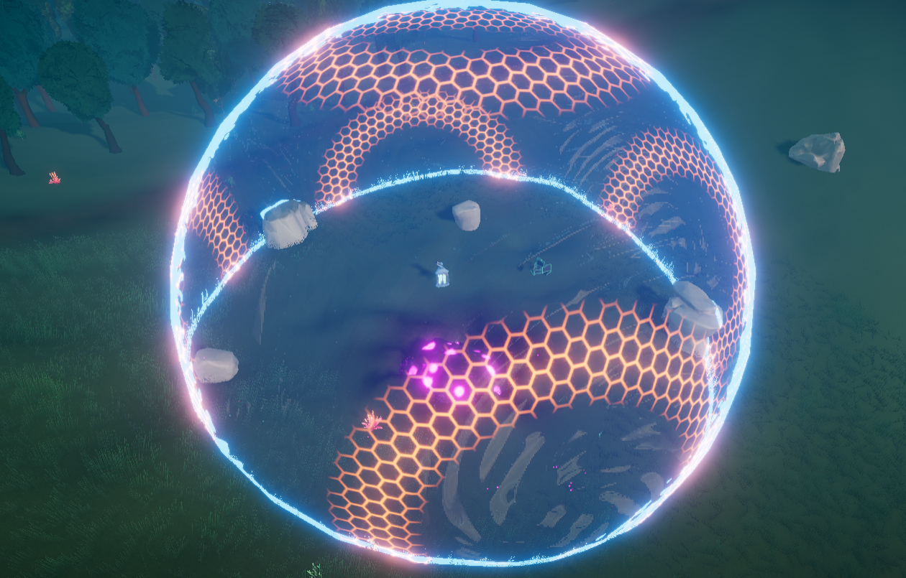
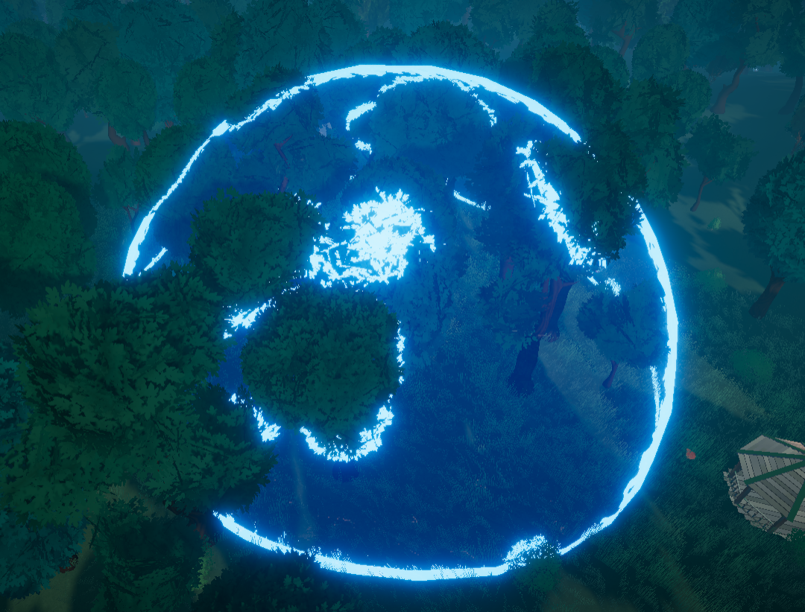
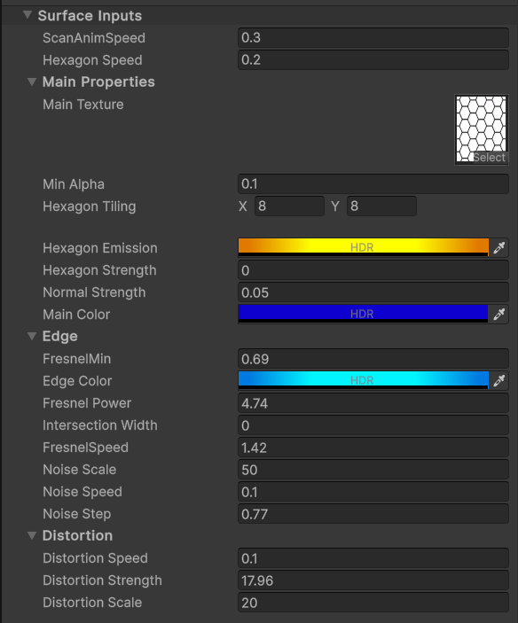
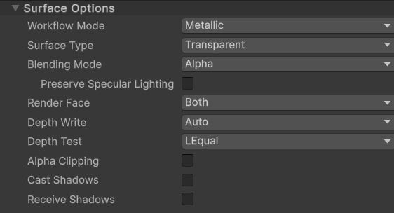

# unity-force-field-shader
A customizable force field shader for Unity URP. Includes glowing edge effects, animated patterns, distortion, and intersection highlights. ideal for sci-fi shields or energy barriers.

## ✨ Preview

## 🛠 Shader Settings

